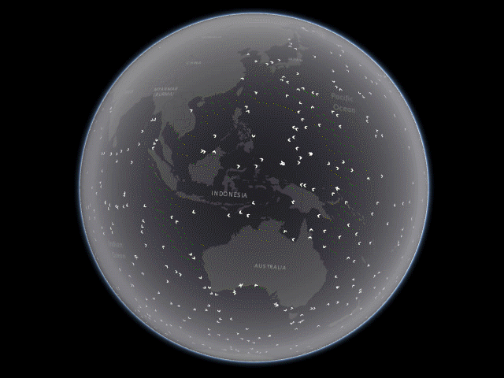

# Ocean Currents

This application was designed and developed by [Esri](http://www.esri.com)'s [Applications Prototype Lab](http://blogs.esri.com/esri/apl/) in Redlands, California. The application was built using the following technologies:

*   [ArcGIS API for JavaScript](http://developers.arcgis.com/javascript/) by [Esri](http://www.esri.com)
*   [Bootstrap](http://getbootstrap.com/) by [Twitter Inc.](https://twitter.com/)
*   [D3.js](http://d3js.org/) by [Mike Bostock](http://bost.ocks.org/mike/)
*   [jQuery](http://jquery.com/) by the jQuery Foundation Inc.
*   [three.js](http://threejs.org/) by [Ricardo Cabello](https://twitter.com/mrdoob) (aka [Mr.doob](https://github.com/mrdoob))

The surface currents data are from the [U.S. Coast Guard](http://www.uscg.mil/)'s Mariano Global Surface Velocity Analysis (MGSVA) Project directed by the [Rosenstiel School of Marine and Atmospheric Science](http://www.rsmas.miami.edu) at the [University of Miami](http://welcome.miami.edu/), Florida. The temporal resolution of the surface current data is monthly while the horizontal resolution is one degree longitude and latitude.

The data was acquired by tracking the movement of several hundred drifting buoys using a satellite. Most of the drifters were equipped with devices to compensate for wind and wave action. These devices were large holey-sock drogues, centered at a depth of 15 m. Ocean currents were estimated by taking the temporal difference of nearby drifter positions. The drifters transmit sensor data to satellites which determine the buoy’s position and relay data to ground stations for processing and distribution. More information about the drifting buoys and the entire Global Ocean Current Velocity Project is described [here](http://oceancurrents.rsmas.miami.edu/index.html).

The downloadable data is available [here](http://oceancurrents.rsmas.miami.edu/data.html) in ASCII tabular text form with fields representing the geographic coordinates, current velocity, and the x (east-west) and y (north-south) vector components of current directions. Azimuthal directions ranging from 0° to 360° have been calculated locally and a raster of these ocean current directions has been created.

